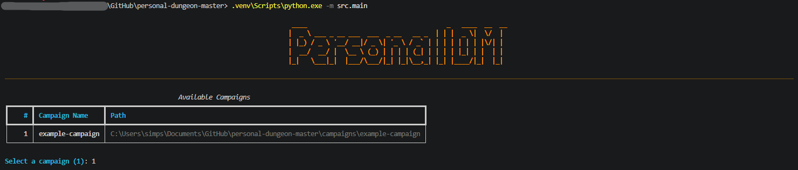
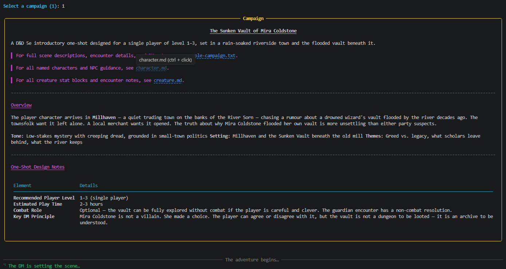
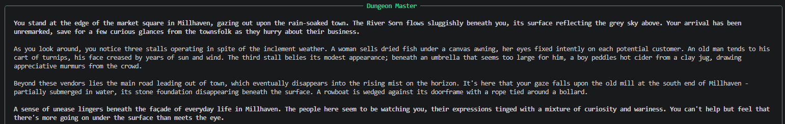

# Personal Dungeon Master

An AI-powered Dungeon Master that reads from structured campaign files and guides a player through a tabletop RPG adventure via a conversational text interface — with voice interaction planned for a future phase.

Runs **entirely locally** — no API keys, no cloud calls, no data leaving your machine. The LLM backend is [llama.cpp](https://github.com/ggerganov/llama.cpp) (or any OpenAI-compatible local inference server such as [LM Studio](https://lmstudio.ai/) or [Ollama](https://ollama.com/)). Support for external cloud providers (OpenAI, Anthropic, Gemini, and others) is planned for a later phase. Built for players who want full privacy and offline play on their own hardware.

---

## Build Status

| Phase | Description | Status |
|---|---|---|
| 1 | Project scaffolding, rules files, example campaign | ✅ Complete |
| 2 | llama.cpp LLM provider, model picker | ✅ Complete (10 tests) |
| 3 | Campaign loading, parsing, and selection | ✅ Complete (52 tests) |
| 4 | Rules system — loader, reference, NarrativeState | ✅ Complete (25 tests) |
| 5 | Memory graph — Graphiti + Kuzu | ✅ Complete (8 tests) |
| 5a | RAG pipeline — semantic chunking, contextual headers, hierarchical index, relevant segment extraction | ✅ Complete (23 tests) |
| 6 | DM agent — context builder, spoiler guard | ✅ Complete (50 tests) |
| 7 | Dice engine — `Die` enum, `RollRequest`/`RollResult`, `roll()`, tag parsing, substitution | ✅ Complete (31 tests) |
| 8 | CLI text interface (`src/interface/cli.py`) and main entry point (`src/main.py`) | ✅ Complete |
| 9 | Polish & reliability — CLI flags, token counting, context window budget, logging | ✅ Complete |
| 10 | Streaming word-by-word output and player interrupt | ✅ Complete |
| 11 | DM personality system — six named personalities | ✅ Complete |
| 12 | Web interface (FastAPI + WebSocket streaming) | 🔲 Not started |
| 13 | DM avatar and campaign image display window | 🔲 Not started |
| 14 | Voice interface — speech-to-text and text-to-speech | 🔲 Not started |
| 15 | Multi-character & party support | 🔲 Not started |
| 16 | Campaign authoring tooling | 🔲 Not started |
| 17 | External LLM provider support (OpenAI, Anthropic, Gemini, etc.) | 🔲 Not started |

**199 tests passing** across Phases 1–8 and the RAG pipeline. Phase 8 is covered by manual end-to-end testing (no unit tests).

---

## Overview

Personal Dungeon Master is a locally-run AI assistant that acts as your Dungeon Master (DM). You select a campaign, and the DM reads the full campaign book, character sheet, creature roster, and campaign summary to build a rich, contextual understanding of the adventure. It then guides you through the story turn by turn — narrating scenes, voicing NPCs, resolving actions, and tracking everything that has happened so far using persistent memory.

The DM is designed to be faithful to the campaign source material while never revealing future events prematurely. It adapts to player choices within the scope of the written adventure, maintaining narrative coherence at all times.

The system runs entirely locally via [llama.cpp](https://github.com/ggerganov/llama.cpp) (or any OpenAI-compatible local inference server). A pluggable LLM provider layer is in place so external cloud providers (OpenAI, Anthropic, Gemini, and others) can be added later without changing any application logic, but the system is designed and tested against local models first.

---

## Screenshots

### Startup — Campaign Selection


*The welcome banner and campaign selection menu on first launch.*

### Campaign Loading — Summary Panel


*After selecting a campaign, a full summary panel is rendered before the adventure begins.*

### In-Session — DM Narration


*The DM narrates scenes in a styled panel. Dice results appear in their own panel above the narration whenever a roll is made.*

---

## Features

### Core
- **Campaign selection** — choose from any campaign folder in your local `campaigns/` directory
- **AI Dungeon Master** — an LLM-powered DM that narrates, responds, and adjudicates in natural language
- **Text-based chat interface** — type your actions and responses; the DM replies in character
- **Persistent memory** — the DM remembers every encounter, decision, and event using a [Graphiti](https://github.com/getzep/graphiti) temporal knowledge graph backed by [Kuzu](https://kuzudb.com/) — an embeddable, file-based graph database (no server required)
- **Campaign-aware context** — the DM reads all campaign files at startup and uses them to stay accurate and immersive
- **Chronological spoiler protection** — the DM will not reveal future events, locations, or enemies before they are reached in the story
- **Character sheet awareness** — the DM tracks player stats, inventory, abilities, and progression
- **Creature reference** — the DM uses creature data for accurate combat narration and encounter descriptions
- **Local model support** — works with any GGUF model served by [llama.cpp](https://github.com/ggerganov/llama.cpp) or any OpenAI-compatible local inference server (e.g., LM Studio, Ollama); runs entirely offline on your own GPU hardware
- **DM personality system** — six named personalities (The Sage, The Chronicler, The Bard, The Tactician, The Warden, The Mentor) selected at session start; each shapes the DM's narrative voice, verbosity, and tone; switchable mid-session with `/personality`
- **Semantic RAG pipeline** — campaign book text is semantically chunked, indexed in a two-tier hierarchical structure, and retrieved via embedding similarity at each turn; relevant segment extraction expands retrieved chunks to adjacent context for richer, more coherent narration
- **Streaming word-by-word output** — the DM's response is streamed token-by-token and rendered live in the terminal using Rich; no waiting for the full reply before reading begins
- **Player interrupt** — press any key while the DM is streaming to cut it off mid-sentence; the partial response is recorded to memory and the next player input is accepted immediately
- **Pluggable LLM providers** — provider abstraction is in place; external cloud providers (OpenAI, Anthropic, Gemini, and others) can be added in Phase 17 without changing any application logic
- **Full 5e rules knowledge** — the DM is grounded in the complete D&D 5th Edition System Reference Document (SRD); it applies rules correctly for combat, spellcasting, ability checks, conditions, and more
- **Rules-accurate adjudication** — when a player attempts an action, the DM applies the correct 5e mechanics (attack rolls, saving throws, skill checks, spell effects) without the player needing to look anything up
- **Integrated dice engine** — the DM rolls all dice using a Python RNG engine with cryptographically seeded randomness; every attack roll, damage roll, saving throw, and skill check uses the correct die type (d4, d6, d8, d10, d12, d20, d100) with appropriate modifiers applied automatically
- **Transparent dice results** — every roll is displayed to the player in the terminal before the DM narrates the outcome, showing the die type, raw roll, modifier, and total

### Planned
- **Fusion retrieval (BM25 + semantic)** — extend the RAG pipeline with BM25 keyword search merged via Reciprocal Rank Fusion for improved recall on entity names and specific terms
- **Contextual compression** — LLM-assisted passage compression to trim retrieved chunks to only the sentences relevant to the current query, reducing context window usage
- **Web interface** — a browser-based chat interface served locally via FastAPI; streams DM output word-by-word via WebSocket, displays the DM avatar, and shows campaign scene images in a visual panel
- **DM avatar** — a distinct character portrait for each DM personality, displayed prominently in the web interface sidebar
- **Campaign image display** — a visual panel in the web interface that automatically surfaces images from the campaign's `images/` directory when the DM narrates a matching location or scene
- **Voice input** — speak your actions to the DM using speech-to-text
- **Voice output** — the DM narrates back using text-to-speech with a consistent voice persona
- **Save & resume** — save the exact state of an adventure and resume from any point
- **Multiple players** — support for a party of characters in a single campaign
- **Custom campaign creation** — tooling to help author new campaigns in the required format
- **Additional ruleset editions** — extend the rules system beyond 5e to support D&D 3.5e, D&D 4e, Pathfinder 1e/2e, and other TTRPGs
- **External LLM providers** — optional cloud backend support (OpenAI, Anthropic, Gemini, and others) via a common provider interface; the system runs fully offline with a local llama.cpp server and can optionally delegate to a cloud model when preferred
- **Animated visual dice** — a rendered dice-roll animation shown to the player when the DM rolls, replacing the plain text result with a visual display

---

## Repository Structure

```
personal-dungeon-master/
├── README.md
├── TODO.md
├── rules/
│   └── 5e/
│       ├── core.md                # Core mechanics (ability scores, proficiency, skills, checks)
│       ├── combat.md              # Combat rules (initiative, action economy, attacks, damage, death)
│       ├── conditions.md          # All condition definitions (blinded, charmed, frightened, etc.)
│       ├── spellcasting.md        # Spellcasting rules, spell slots, concentration, ritual casting
│       └── equipment.md           # Weapons, armor, adventuring gear, encumbrance rules
├── campaigns/
│   └── example-campaign/
│       ├── README.md              # Campaign summary and lore overview
│       ├── character.md           # Player character sheet (stats, inventory, backstory)
│       ├── creature.md            # Bestiary for this campaign (all enemies and NPCs)
│       └── example-campaign.txt   # The full campaign book (encounters, locations, story)
├── src/
│   ├── main.py                    # Entry point — campaign selection and session loop
│   ├── dm/
│   │   ├── dungeon_master.py      # Core DM agent (LLM orchestration)
│   │   ├── context_builder.py     # Loads and structures campaign files into LLM context
│   │   ├── personality.py         # Six named DM personalities with system-prompt directives
│   │   ├── spoiler_guard.py       # Ensures the DM does not reference future campaign events
│   │   └── memory/
│   │       ├── graphiti_store.py  # Graphiti wrapper — episode ingestion and hybrid search
│   │       ├── graphiti_factory.py# Builds Graphiti LLM/embedder clients for llama.cpp
│   │       ├── session_store.py   # Short-term sliding window of recent messages
│   │       └── manager.py         # MemoryManager — composes graph + session + progress
│   ├── llm/
│   │   ├── base.py                # Abstract LLMProvider interface
│   │   ├── llamacpp_provider.py   # llama.cpp local model implementation (current)
│   │   └── factory.py             # Instantiate the correct provider from config
│   ├── rules/
│   │   ├── loader.py              # Loads rule files for the configured game edition
│   │   └── reference.py           # Retrieves relevant rules sections for a given context
│   ├── dice/
│   │   ├── die.py                 # Die enum (d4, d6, d8, d10, d12, d20, d100) and RollResult dataclass
│   │   └── roller.py              # Core dice engine: roll(), roll_multiple(), advantage/disadvantage
│   ├── campaign/
│   │   ├── loader.py              # Reads and validates campaign folder structure; async enrich_campaign()
│   │   ├── parser.py              # Parses campaign book, character sheet, and creature file
│   │   ├── chunker.py             # Semantic chunking — splits campaign text into coherent CampaignChunk objects
│   │   ├── header.py              # Contextual chunk headers — prepends [Act | Scene] context before embedding
│   │   ├── index.py               # Hierarchical two-tier index (act summaries + fine-grained chunks)
│   │   ├── segment_extractor.py   # Relevant segment extraction — expands retrieved chunks to adjacent context
│   │   └── selector.py            # Interactive campaign selection at startup
│   ├── interface/
│   │   └── cli.py                 # Text-based terminal chat interface
│   └── config.py                  # Configuration (model selection, paths, settings)
├── memory/
│   └── <campaign_name>/
│       ├── graphiti.kuzu/         # Kuzu graph database (entities, relationships, temporal facts)
│       ├── session.json           # Short-term sliding window of recent messages
│       ├── progress.json          # Current scene/section pointer (spoiler guard state)
│       ├── campaign_chunks.pkl    # Cached semantic chunks (built once, reused each session)
│       └── campaign_index.pkl     # Cached hierarchical retrieval index (built once, reused each session)
├── tests/
│   ├── test_loader.py
│   ├── test_parser.py
│   ├── test_memory.py
│   ├── test_rules.py
│   ├── test_dice.py
│   ├── test_dm.py
│   ├── test_llm.py
│   └── test_chunker.py
├── .env.example                   # Template for API keys and environment variables
├── requirements.txt               # Python dependencies
└── pyproject.toml                 # Project metadata and tooling config
```

---

## Campaign Folder Format

Each campaign lives in its own folder under `campaigns/`. The folder name becomes the campaign identifier.

### `README.md` — Campaign Summary
A high-level overview of the campaign: setting, tone, main plot hooks, and any player-facing lore that is safe to know before the adventure begins.

```markdown
# The Lost Mines of Phandelver

**Setting:** The Sword Coast, Faerûn  
**Recommended Level:** 1–5  
**Tone:** Classic heroic fantasy, dungeon exploration  

## Summary
The players are hired to escort a wagon to Phandalin...
```

### `character.md` — Character Sheet
Full character details for the player character(s). This includes stats, class, race, background, abilities, spells, inventory, and any backstory relevant to the campaign.

```markdown
# Aldric Stoneforge

**Race:** Dwarf  
**Class:** Fighter (Level 1)  
**Background:** Soldier  

## Ability Scores
| STR | DEX | CON | INT | WIS | CHA |
|-----|-----|-----|-----|-----|-----|
| 16  | 12  | 15  | 10  | 13  | 8   |

## Equipment
- Chain mail
- Longsword
- Shield
...
```

### `creature.md` — Bestiary
A catalogue of all creatures (enemies, beasts, and key NPCs) the player may encounter. Each entry includes stat blocks, abilities, and flavor text the DM can use for narration.

```markdown
# Creature Reference

## Goblin
**Type:** Humanoid (Goblinoid)  
**CR:** 1/4  
**HP:** 7 | **AC:** 15  
**Speed:** 30 ft.

**Attacks:** Scimitar +4 (1d6+2 slashing), Shortbow +4 (1d6+2 piercing)  
**Traits:** Nimble Escape — can Disengage or Hide as a bonus action.

*Flavor:* Goblins are small, black-hearted humanoids that lair in...
```

### `[campaign_name].txt` — Campaign Book
The full campaign text, written sequentially. This is the authoritative source for locations, encounters, NPCs, story beats, and outcomes. The DM reads this file in full at startup and uses it as its primary reference. The DM will only surface information from sections that have been chronologically reached in the current adventure.

---

## Getting Started

### Reference Hardware

This system was built and tested on the following hardware:

| Component | Specification |
|---|---|
| **OS** | Windows 11 Home 64-bit |
| **CPU** | 12th Gen Intel Core i5-12500H (16 logical CPUs) @ ~2.5 GHz |
| **RAM** | 32 GB DDR5 |
| **GPU** | NVIDIA GeForce RTX 4060 Laptop GPU (8 GB VRAM) |

The RTX 4060 Laptop GPU (8 GB VRAM) runs `llama3.1:8b` fully on-GPU at a comfortable speed (~20–30 tokens/sec). Models larger than ~8B parameters will exceed the VRAM budget and fall back to slower CPU offloading or become impractical without quantization.

**Minimum recommended hardware:**
- 8 GB system RAM (16 GB+ recommended for larger models)
- NVIDIA GPU with 6 GB+ VRAM for GPU inference, or a modern CPU with 16 GB+ RAM for CPU-only inference (significantly slower)
- 10 GB free disk space for models and the Kuzu graph database

> **macOS / Linux**: The system is cross-platform. The setup commands below use Windows paths — substitute the `source .venv/bin/activate` activation command for macOS/Linux.

### Prerequisites
- Python 3.11+
- A **local LLM server** exposing an OpenAI-compatible API (`/v1/chat/completions` and `/v1/embeddings`). Any of the following will work:
  - **[llama.cpp server](https://github.com/ggerganov/llama.cpp/tree/master/examples/server)** (`llama-server`) — default backend, runs at `http://localhost:8080`
  - **[LM Studio](https://lmstudio.ai/)** — GUI-based, exposes a compatible local server
  - **[Ollama](https://ollama.com/)** — set `LLAMACPP_BASE_URL=http://localhost:11434` to use Ollama's OpenAI-compatible endpoint
  - A mid-range GPU (e.g., RTX 4060 8 GB) can run 8B–13B parameter models comfortably
  - Models with strong tool-calling / structured output are required for Graphiti memory extraction: `llama3.1:8b`, `qwen2.5:7b`, `mistral-nemo`, `deepseek-r1:7b`
  - An embedding model is required for memory retrieval — `nomic-embed-text` must be available via `/v1/embeddings` on the same server
- A campaign folder set up under `campaigns/`

### Installation

```bash
git clone https://github.com/your-username/personal-dungeon-master.git
cd personal-dungeon-master
python -m venv .venv
.venv\Scripts\activate      # Windows
# source .venv/bin/activate  # macOS/Linux
pip install -r requirements.txt
```

### Configuration

Copy `.env.example` to `.env` and configure your chosen backend:

```bash
cp .env.example .env
```

**Local llama.cpp server (the only supported backend right now):**
```env
LLM_PROVIDER=llamacpp
LLAMACPP_BASE_URL=http://localhost:8080
DM_MODEL=llama3.1:8b
EMBEDDING_MODEL=nomic-embed-text
CAMPAIGNS_DIR=./campaigns
MEMORY_DIR=./memory
GAME_EDITION=5e
RULES_DIR=./rules
SESSION_WINDOW=20
GRAPHITI_TELEMETRY_ENABLED=false
```

Make sure your local server is running and serving both the chat model and an embedding model before starting. For llama.cpp server:
```bash
llama-server --model path/to/llama3.1-8b.gguf --port 8080
```

If using Ollama, set `LLAMACPP_BASE_URL=http://localhost:11434` and pull the required models:
```bash
ollama pull llama3.1:8b
ollama pull nomic-embed-text
```

If `DM_MODEL` is not set, the startup menu will list your available local models and let you pick one interactively.

### Running

```bash
python -m src.main
```

You will be prompted to select a campaign. Once selected, the DM will load all campaign files, initialize memory, and begin the adventure. See the [Screenshots](#screenshots) section above for examples of what to expect.

#### In-session commands

| Command | Description |
|---|---|
| `/help` | List all available commands |
| `/status` | Display character stats and inventory |
| `/journal` | Show all entities extracted by the knowledge graph |
| `/graph <entity>` | Look up a specific entity and its relationships |
| `/roll <expr>` | Roll dice at any time (e.g. `/roll d20+3`, `/roll 2d6`) |
| `/save` | Explicitly save the session state |
| `/reset` | Wipe the session window (graph is preserved) |
| `/fullreset` | Wipe session window and knowledge graph (restart campaign) |
| `/rules <topic>` | Look up a rules topic (e.g. `/rules grapple`, `/rules concentration`) |
| `/personality` | View or switch the active DM personality |
| `/quit` or `/exit` | Save and exit |

---

## How It Works

### 1. Campaign Loading
At startup, the `campaign/loader.py` module scans the `campaigns/` directory, validates each campaign folder, and presents a selection menu. Once chosen, `parser.py` reads all four campaign files into structured data objects.

### 2. LLM Provider Selection
`llm/factory.py` reads `LLM_PROVIDER` from config and instantiates the correct provider. Currently only `llamacpp` is supported; additional provider support is planned for a later phase.

`LlamaCppProvider` calls any OpenAI-compatible endpoint (`{LLAMACPP_BASE_URL}/v1/chat/completions`) via the `openai` SDK — no real API key required. At startup it checks `GET {base_url}/health` to verify the server is reachable, then queries `/v1/models` to discover the model's context window length. This means [llama.cpp server](https://github.com/ggerganov/llama.cpp/tree/master/examples/server), [LM Studio](https://lmstudio.ai/), or [Ollama](https://ollama.com/) (via its `/v1/` endpoint) all work as backends.

All providers implement the same `LLMProvider` abstract interface: `complete(messages, **kwargs) -> str`. The DM agent never references a specific backend directly.

If `DM_MODEL` is not set, the startup sequence lists available models from the server and displays an interactive model picker.

### 3. Rules Loading
`rules/loader.py` reads the edition set in `GAME_EDITION` (default `5e`) and loads all rule files from `rules/5e/` into a structured `RulesReference` object. This object is passed to the context builder and is available for the DM agent to draw from throughout the session.

`rules/reference.py` exposes a `get_relevant_rules(context: str) -> str` helper that returns the most pertinent rules sections given a narrative context (e.g., combat started → return combat rules; a spell is cast → return spellcasting rules). This keeps the rules portion of the system prompt focused and within token budget.

### 4. Dice Engine
All dice rolls are performed by `dice/roller.py` using Python's `random` module seeded from `secrets.randbits()` at session start, guaranteeing real randomness the LLM cannot predict or influence.

The LLM **never** generates roll results itself — instead it emits a structured roll tag (e.g., `[ROLL: attack d20+5]`) wherever a roll is required. The DM agent intercepts every tag in the raw response, calls the dice engine, and substitutes real results before the narrative is rendered. The resolved results are also injected as a system message so the LLM narrates from the actual outcome on its next turn.

The `Die` enum (`d4`, `d6`, `d8`, `d10`, `d12`, `d20`, `d100`) constrains every roll to the correct physical die. The engine supports:
- `roll(die, modifier)` — single die with modifier
- `roll_multiple(n, die)` — multi-dice expressions (e.g., 2d6 for a greatsword)
- `roll_advantage(die)` / `roll_disadvantage(die)` — roll twice, keep highest/lowest

Every roll result is displayed to the player in the terminal (die type, each individual roll, modifier, total) before the DM narrates the outcome.

### 5. Context Building
`dm/context_builder.py` assembles a system prompt for the LLM. This prompt includes:
- The DM persona and behavioral rules
- The game edition and active rules reference (relevant sections from `rules/5e/` via `get_relevant_rules()`)
- The campaign summary and tone
- The full character sheet
- The full creature reference
- **Campaign book context** — when the RAG pipeline index is available, the most relevant campaign passages are retrieved via two-tier hierarchical embedding search and expanded with relevant segment extraction; otherwise the raw revealed window up to the current scene is used
- **Retrieved graph memory context** — the most relevant entities and relationships from the Graphiti knowledge graph for the current turn (via `MemoryManager.get_context()`), injected as a structured block
- **Short-term session window** — the last N conversation turns (configurable via `SESSION_WINDOW`)

### 6. Spoiler Guard
`dm/spoiler_guard.py` maintains a pointer into the campaign book representing how far the player has progressed. Only content up to and including the current narrative position is included in the LLM context. Future encounters, plot twists, and locations are withheld until the player reaches them.

### 7. Memory
The `dm/memory/` subpackage maintains two forms of memory:

- **Knowledge graph** (long-term) — powered by [Graphiti](https://github.com/getzep/graphiti) with a [Kuzu](https://kuzudb.com/) embedded graph database. After each DM response, the response is ingested as a Graphiti *episode*. Graphiti automatically extracts named entities (NPCs, locations, items, factions, events) and relationships, stores them as temporally-tagged nodes and edges, and handles deduplication. At the next turn, `MemoryManager.get_context()` calls `graphiti.search()` — hybrid semantic + keyword + graph traversal — to retrieve only the most relevant facts for injection into the system prompt. No full-history dump; no summarization needed.

- **Session window** (short-term) — the last N raw `{role, content}` messages, managed by `SessionStore` and stored in `memory/<campaign_name>/session.json`. Appended after every turn and trimmed to `SESSION_WINDOW` (default 20).

- **Progress pointer** — the current scene index stored in `memory/<campaign_name>/progress.json`, used by the spoiler guard to determine how much of the campaign book is visible.

> **Model requirement**: Graphiti's entity extraction uses LLM structured output (tool/function calling). Use a model with strong tool-calling support such as `llama3.1:8b`, `qwen2.5:7b`, or `mistral-nemo`. Smaller or older models may produce malformed extraction output that Graphiti will silently skip.

### 8. The Chat Loop
The main loop in `interface/cli.py` accepts text input from the user and passes it to the DM agent. The DM's response is streamed token-by-token via `DungeonMaster.respond_stream()` and rendered live using Rich's `Live` panel — the player sees words appear in real time rather than waiting for the full reply. While streaming, a background thread watches for any keypress; if triggered, a `threading.Event` signals the generator to stop early, the partial response is marked as interrupted, and the next player input is accepted immediately. The conversation continues until the user quits.

---

## DM Behavior & Persona

The DM is instructed to:
- Narrate in an immersive, engaging second-person voice ("You step into the dimly lit tavern...")
- Voice NPCs distinctly, using their names and personalities from the campaign book
- Signal dice rolls using a structured tag (e.g., `[ROLL: attack d20+5]`) rather than narrating a result directly — the dice engine intercepts these tags, performs the real roll, and the DM narrates the outcome from the actual result
- Use the correct die for every situation: d20 for attack rolls and skill checks, weapon-specific dice for damage (d6 for shortsword, d8 for longsword, 2d6 for greatsword, etc.), d8 for healing spells, and so on
- Apply 5e rules correctly and consistently: attack rolls, saving throws, ability checks, spell effects, conditions, and action economy
- Reference the character sheet for class features, spell slots, proficiencies, and modifiers when adjudicating player actions
- Apply creature stat blocks accurately during combat (AC, HP, attacks, special traits)
- Handle edge cases (contested rolls, cover, concentration, opportunity attacks) according to RAW (Rules As Written) by default
- Never break the fourth wall or acknowledge being an AI unless the user explicitly asks
- Advance the story only as fast as the player drives it
- Emit `[ROLL: ...]` tags for every dice roll — never invent results
- Keep narration consistent with facts stored in memory (the Graphiti knowledge graph supplies these as context)

---

## DM Personalities

At session startup, the player chooses a Dungeon Master personality. The selection shapes the DM's narrative voice, level of detail, and disposition for the entire session. The personality is injected as a behavioral directive in the system prompt and can be changed mid-session with `/personality`.

| Personality | Tone | Verbosity | Description |
|---|---|---|---|
| **The Sage** | Kind | Balanced | Measured, wise, and balanced. Thoughtful pacing. Kind but honest about consequences. The reliable default. |
| **The Chronicler** | Kind | Verbose | Literary narrator. Richly detailed scenes with evocative prose — every shadow, scent, and texture accounted for. Never rushes. |
| **The Bard** | Neutral | Verbose | Theatrical and charismatic. Every NPC voiced with dramatic flair. Leans into humor, unexpected twists, and memorable moments. |
| **The Tactician** | Neutral | Concise | Precise and rules-focused. Narration is efficient and clear. Mechanical accuracy and fair challenge above all else. |
| **The Warden** | Harsh | Concise | Austere and unforgiving. Terse narration, permanent consequences, real danger. The world does not forgive mistakes. |
| **The Mentor** | Kind | Balanced | Patient, encouraging, and beginner-friendly. Explains rules clearly, celebrates good decisions, and guides gently. |

---

## Rules System

The DM's rules knowledge is stored in the `rules/` directory as plain Markdown files, organized by game edition. The initial edition is **D&D 5th Edition**, sourced from the [5e SRD (Systems Reference Document)](https://dnd.wizards.com/resources/systems-reference-document), which is released under Creative Commons CC-BY-4.0 and free to use.

### Rule Files (`rules/5e/`)

| File | Contents |
|---|---|
| `core.md` | Ability scores, modifiers, proficiency bonus, advantage/disadvantage, skill checks, saving throws, passive scores |
| `combat.md` | Initiative, turn structure, action economy (action/bonus action/reaction/movement), attack rolls, damage, critical hits, death saving throws, conditions applied in combat |
| `conditions.md` | Full definitions of all 15 conditions (blinded, charmed, deafened, exhaustion, frightened, grappled, incapacitated, invisible, paralyzed, petrified, poisoned, prone, restrained, stunned, unconscious) |
| `spellcasting.md` | Spell slots, casting time, range, components, concentration, ritual casting, spell attack rolls, saving throw DCs, spell schools |
| `equipment.md` | Weapon properties, armor categories, encumbrance, improvised weapons, silvered/magical weapons |

### How Rules Are Used

At session startup, all rule files for the configured edition are loaded into a `RulesReference` object. The context builder injects relevant sections into the system prompt based on the current `NarrativeState` (`EXPLORATION`, `COMBAT`, `SOCIAL`, `REST`). In combat, `combat.md` + `conditions.md` + `core.md` are included; if a spellcasting keyword appears in the current turn, `spellcasting.md` is added automatically. This keeps the DM accurate without consuming the entire context window with rules on every turn.

For very large rulesets (e.g., Pathfinder 2e), full inclusion can be replaced with RAG over the rules directory — the `RulesReference` object is designed to support this as a future drop-in.

---

## Local Model Recommendations

Model choice has a significant impact on narration quality, response speed, and memory extraction accuracy. Graphiti's entity extraction requires structured output / tool-calling support, so models with strong function-calling capabilities are preferred. The models listed below are available as GGUF files on [HuggingFace](https://huggingface.co/) for use with llama.cpp, or can be pulled directly with Ollama.

| Model | Size | Notes |
|---|---|---|
| `llama3.1:8b` | ~5 GB | **Recommended** — strong tool-calling, good narration quality |
| `qwen2.5:7b` | ~5 GB | Excellent structured output; strong reasoning |
| `mistral-nemo` | ~7 GB | Strong instruction following and tool-calling |
| `deepseek-r1:7b` | ~5 GB | Good reasoning for complex encounter adjudication |
| `llama3.1:70b-q4` | ~40 GB | Requires high VRAM; best quality if hardware allows |

The embedding model (`nomic-embed-text`) must also be served via `/v1/embeddings` on the same server. If using Ollama:
```bash
ollama pull nomic-embed-text
```
For llama.cpp server, load a GGUF version of `nomic-embed-text` and run a server that supports both chat completions and embedding endpoints simultaneously.

Larger models (30B+) require more VRAM or CPU offloading (slower). The context window of the chosen model is automatically queried at startup and respected — the system will warn if campaign + memory content approaches the model's context length.

---

## Voice Interface (Future)

The planned voice interface will use:
- **Speech-to-text**: capture the player's spoken input and transcribe it — `faster-whisper` (runs locally, no API needed) is the preferred option for fully offline setups
- **Text-to-speech**: read the DM's response aloud using a consistent, atmospheric voice
- A push-to-talk or voice activity detection (VAD) mode

The text interface and voice interface will share the same underlying DM agent, differing only in the I/O layer.

---

## Contributing

This is a personal project, but contributions and ideas are welcome. Please open an issue before submitting a pull request.

---

## License

MIT
